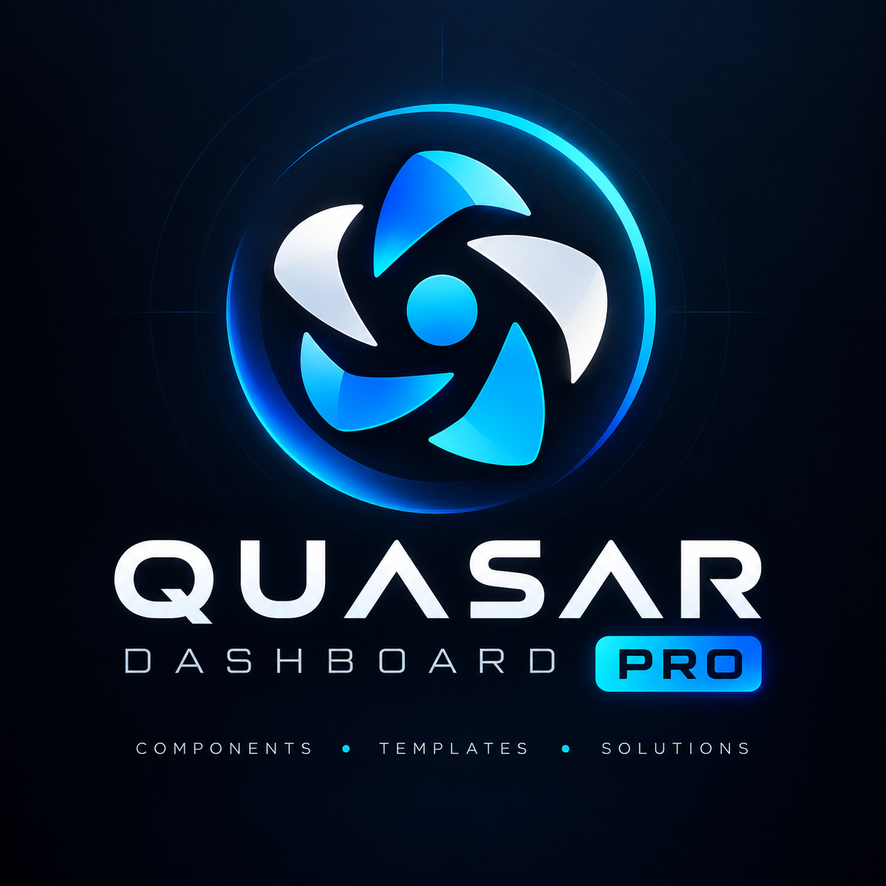

<div align="center">
  

# Quasar Dashboard PRO

**Um template de dashboard administrativo gratuito e open source, feito com Vue 3, Quasar 2 e TypeScript.**
Uma UI polida e pronta para negócios, que você pode usar direto em um produto real — não é mais um starter kit vazio.

[](./LICENSE)


🇺🇸 [Read in English](./README.md) · 🇧🇷 Português (este arquivo)
</div>

---

## Por que este template

A maioria dos dashboards gratuitos é uma pilha de telas de demonstração sem relação entre si. O Quasar Dashboard PRO é organizado em **módulos de negócio prontos para uso** — Finance, CRM, E-Commerce, Fleet Tracking — cada um com fluxos reais e conectados (não apenas telas isoladas), para você remover o que não precisa e lançar o resto.

- **Módulos de negócio, não telas soltas** — Finance, CRM, E-Commerce e Fleet Tracking, cada um em uma pasta autocontida e fácil de copiar.
- **Fluxos de UI reais** — um funil de checkout completo, um kanban com drag de negociações, uma caixa de entrada com painel de leitura, um mapa ao vivo com rastreamento animado de veículos — não apenas tabelas estáticas.
- **Stack moderna, feita certo** — Vue 3 `<script setup>`, Quasar 2, TypeScript em tudo, Pinia, Vite. Sem Options API, sem resquícios de JavaScript puro.
- **Um design system, não só componentes** — uma cor de destaque, um raio de borda, um padrão de diálogo de detalhes, aplicados de forma consistente em todos os módulos.
- **Dark mode** que realmente parece finalizado, não uma inversão de cores feita às pressas.
- **100% gratuito, licenciado sob Apache-2.0** — use em projetos pessoais ou comerciais, sem necessidade de atribuição.

## Funcionalidades

- Estrutura de dashboard responsiva: sidebar agrupada e recolhível, header com alternância de dark mode, notificações e menu de conta
- Fluxo de autenticação de demonstração com sessão persistida e proteção de rotas
- Gráficos (ApexCharts) ajustados para ficarem corretos tanto no modo claro quanto no escuro
- Um padrão compartilhado de `RecordDetailDialog`, para que toda lista/tabela do app abra detalhes da mesma forma
- Um pipeline de observabilidade animado, com sensação de tempo real (feito com Vue Flow), e um efeito de "radar" pulsante nos marcadores do mapa ao vivo
- Mapa com Leaflet, marcadores customizados e zonas de risco geolocalizadas — sem necessidade de chave de API
- Totalmente tipado do início ao fim, com ESLint + Prettier configurados de forma estrita

## Módulos incluídos

| Módulo             | Rotas          | O que tem dentro                                                                                                                                                                                                                                                                                               |
| ------------------ | -------------- | -------------------------------------------------------------------------------------------------------------------------------------------------------------------------------------------------------------------------------------------------------------------------------------------------------------- |
| **Finance**        | `/finance/*`   | Overview (cards de moeda com sparklines, gráfico de receitas/despesas, distribuição de orçamento, medidor de score de crédito), Transactions (tabela completa de histórico), Accounts                                                                                                                          |
| **CRM**            | `/crm/*`       | Overview (gráfico de pipeline por estágio, estatísticas de leads, próximas atividades), Leads (tabela completa), Deals (kanban por estágio), Mail (caixa de entrada com pastas, painel de leitura e composição)                                                                                                |
| **E-Commerce**     | `/ecommerce/*` | Fluxo completo de produto até pedido: Products (grid com busca/filtro/ordenação) → detalhe do produto (galeria, quantidade, wishlist, produtos relacionados) → Shopping Cart → Checkout (stepper de envio/pagamento/revisão) → recibo de Order Summary, além de Order History com stepper de status de entrega |
| **Fleet Tracking** | `/fleet/*`     | Live Map (marcadores animados de veículos, zonas de risco geolocalizadas, pipeline de observabilidade animado), Vehicles (tabela de status/combustível/motorista), Trip History (replay de rota com linha do tempo de paradas), Alerts & Maintenance (feed de alertas filtrável por severidade)                |

Além do "núcleo" compartilhado: autenticação (login de demonstração, proteção de rotas, sessão persistida), a estrutura do dashboard e as stores Pinia.

Mais segmentos e páginas serão adicionados com o tempo — contribuições são bem-vindas.

## Stack técnica

- [Vue 3](https://vuejs.org) (Composition API, `<script setup>`)
- [Quasar 2](https://quasar.dev) com o CLI baseado em Vite (`@quasar/app-vite`)
- [TypeScript](https://www.typescriptlang.org)
- [Pinia](https://pinia.vuejs.org) para gerenciamento de estado
- [Vue Router](https://router.vuejs.org) (modo history) com guarda de navegação para rotas autenticadas
- [ApexCharts](https://apexcharts.com) para os gráficos do dashboard
- [Leaflet](https://leafletjs.com) + [@vue-leaflet/vue-leaflet](https://github.com/vue-leaflet/vue-leaflet) para o mapa do Fleet Tracking
- [Vue Flow](https://vueflow.dev) para o pipeline de observabilidade animado
- [Material Symbols Outlined](https://fonts.google.com/icons) para os ícones (remapeados globalmente em [`src/boot/icon-map.ts`](./src/boot/icon-map.ts), sem necessidade de alterar cada componente)
- [Inter](https://rsms.me/inter/) (hospedada localmente via `@fontsource-variable/inter`) como fonte padrão
- ESLint (flat config) + Prettier

## Arquitetura: módulos por segmento de negócio

Em vez de um dashboard genérico único, as páginas são organizadas **por segmento de negócio** em `src/modules/<segmento>/`, cada um autocontido (`pages/`, `components/`, `data/`, `routes.ts`, `nav.ts`). Registrar um módulo são duas linhas em [`src/modules/index.ts`](./src/modules/index.ts) — assim um módulo pode ser copiado para outro projeto sem arrastar o resto da aplicação junto.

Cada módulo contribui com seu próprio grupo rotulado na sidebar (ex.: **Finance** → Overview / Transactions / Accounts), o mesmo padrão de "seção + subpáginas" usado pela maioria dos templates de dashboard administrativo.

## Convenções de UI

- **Clique em linha/card → diálogo de detalhes.** Toda lista ou tabela de registros (transações, leads, veículos...) abre um diálogo com os detalhes daquele registro ao ser clicada, através do componente compartilhado [`src/components/RecordDetailDialog.vue`](./src/components/RecordDetailDialog.vue) — basta passar `title`, `subtitle`/avatar opcionais e um array `fields: {label, value, color?}[]`. Novas listas devem seguir o mesmo padrão em vez de criar um diálogo específico.
- **Tudo arredondado.** Cards, botões e diálogos compartilham um único raio de borda (`$generic-border-radius` / `$button-border-radius`, ambos 12px, em [`quasar.variables.scss`](./src/css/quasar.variables.scss)) — não sobrescreva o raio por componente, altere o token.

## Como começar

Requer Node.js `^22.12 || ^24 || >=26` e [pnpm](https://pnpm.io).

```bash
pnpm install
```

### Servidor de desenvolvimento

```bash
pnpm dev
```

### Lint & formatação

```bash
pnpm lint        # corrige os problemas
pnpm lint:check  # apenas verifica
```

### Verificação de tipos

```bash
pnpm typecheck
```

### Build de produção

```bash
pnpm build
```

A configuração fica em [`quasar.config.ts`](./quasar.config.ts) — veja a [documentação do Quasar CLI](https://v2.quasar.dev/quasar-cli-vite/quasar-config-file).

## Desenvolvimento assistido por IA (MCP)

Este repositório já vem com uma configuração de [servidor MCP do Quasar](https://quasar.dev/start/ai-agents#setup) para agentes de IA (Claude Code, VS Code, etc.) em [`.mcp.json`](./.mcp.json) / [`.vscode/mcp.json`](./.vscode/mcp.json). Isso dá ao agente acesso offline à documentação e às APIs de componentes do Quasar exatamente nas versões instaladas em `node_modules` — sem configuração extra, é detectado automaticamente ao abrir o projeto.

## Contribuindo

Issues e PRs são bem-vindos. Este é um template comunitário — o objetivo é mantê-lo alinhado com as melhores práticas atuais de Vue/Quasar, não acumular funcionalidades pontuais.

## Licença

Distribuído sob a [Apache License 2.0](./LICENSE) — gratuito para uso pessoal e comercial, sem necessidade de atribuição.
